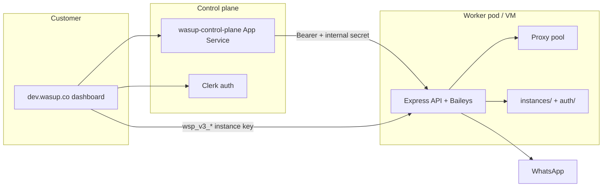

# Wasup v3 Worker Platform

End-to-end guide for the WhatsApp worker (`app/`), Docker packaging, proxy pool, per-instance API keys, interactive messaging, and how it connects to the Wasup v3 control plane.

## Architecture



| Layer | Role |
|-------|------|
| **Dashboard** (`apps/polymet-wasup`) | Clerk sign-in, org workspace, connection UI |
| **Control plane** (`apps/control-plane`) | Billing, provisioning, worker registry, proxy import |
| **Worker** (`app/`) | WhatsApp sessions, send/receive, anti-ban, proxy egress |
| **OpenAPI + `/docs`** | Scalar UI for API exploration (password optional) |

## Worker features (this repo)

### Native interactive messages

Buttons and lists are sent through native WhatsApp interactive messages only — no legacy text fallbacks for button UI.

- Builder: `app/src/utils/message-builder.js`
- API: `POST /api/instances/:id/send` with `interactive` payload
- Playground: `app/public/test.html`

### Reactions

```bash
curl -X POST "https://wasup-dev.example/api/instances/wa_xxx/react" \
  -H "X-API-Key: YOUR_KEY" \
  -H "Content-Type: application/json" \
  -d '{"jid":"60123456789@s.whatsapp.net","messageId":"ABC123","emoji":"👍"}'
```

Also available: `POST /api/react` (auto-select connected instance).

### Per-instance API keys (`wsp_v3_*`)

Create an instance with a scoped key:

```bash
curl -X POST http://localhost:3000/api/instances \
  -H "Content-Type: application/json" \
  -d '{"name":"customer-a","generateApiKey":true}'
```

The plaintext key is returned once. Use it for instance-scoped routes:

```bash
curl http://localhost:3000/api/instances/wa_xxx/proxy \
  -H "X-API-Key: wsp_v3_..."
```

Implementation: `app/src/utils/instance-api-keys.js` — pepper-compatible with the v3 control plane.

### Authentication layers

| Key / header | Scope |
|--------------|-------|
| `API_KEY` (env) | Deployment admin — all routes |
| `X-API-Key: wsp_v3_*` | Single instance |
| `X-Wasup-Worker-Secret` | Internal heartbeat from control plane |

### Proxy pool (Webshare-style)

Format: `host:port:user:pass` (one per line in `PROXY_POOL` or pool files).

| Endpoint | Purpose |
|----------|---------|
| `GET /api/proxy` | Global proxy status |
| `GET/PUT /api/proxy/pool` | List / replace pool |
| `GET/PUT /api/instances/:id/proxy` | Instance proxy attach/detach |
| `POST /api/instances/:id/proxy/verify` | Confirm egress IP |

Utilities: `app/src/utils/proxy.js`, `app/src/utils/proxy-pool.js`.

On connect, the instance uses the assigned proxy for Baileys `agent` / `fetchAgent`.

### API docs (`/docs`)

- `GET /docs` — Scalar OpenAPI UI (`app/public/docs.html`)
- `GET /api/openapi.yaml` — live spec
- Optional unlock via `DOCS_PASSWORD` + `POST /api/docs/unlock`

### Single-instance mode (v3 pod)

For one customer per container:

```env
WASUP_WORKER_MODE=single-instance
WASUP_INSTANCE_ID=wa_customer123
WASUP_ORG_ID=org_abc
WASUP_DATA_DIR=/data
```

One instance is auto-created on boot; data persists on the mounted volume.

## Local development

```bash
cd app
npm install
npm start
# Admin: http://localhost:3000
# Playground: http://localhost:3000/test.html
# API docs: http://localhost:3000/docs
```

Docker:

```bash
docker compose up -d --build
open http://localhost:3000
```

## Azure deployment

Scripts live in `infra/azure/docker/`. See [`infra/azure/docker/README.md`](../../infra/azure/docker/README.md).

| Target | Script | URL (dev) |
|--------|--------|-----------|
| ACR image build | `build-push.sh` | `wasupworkeracr.azurecr.io/wasup-worker` |
| App Service container | `deploy-webapp.sh` | `wasup-worker-dev.azurewebsites.net` |
| VM sync (PM2 or Docker) | `sync-vm-worker.sh` | `wasup-dev`, `wasup2` VMs |

**Important:** Always use `sync-vm-worker.sh` for VM deploys — partial rsync (e.g. `server.js` without `proxy.js`) causes 502 crashes.

### Smoke test

```bash
cd app
node scripts/wasup-smoke.js --base-url https://wasup-dev.northeurope.cloudapp.azure.com
```

Checks health, OpenAPI, `/docs`, proxy routes, and negative-path validation.

## Control plane integration

The v3 control plane (branch `feature/wasup-v3-control-plane`, `apps/control-plane` + `apps/polymet-wasup`) handles:

- Clerk orgs and customer dashboard at **dev.wasup.co**
- Stripe billing and entitlements
- VM / App Service provisioning per org
- Worker heartbeat: `POST /api/internal/heartbeat`
- Proxy pool import and attach via internal APIs

Deploy dashboard (static to Azure Storage + Front Door):

```bash
DASHBOARD_STORAGE_ACCOUNT=... \
FRONTDOOR_PROFILE=... FRONTDOOR_ENDPOINT=... \
./deploy/deploy-dashboard-frontend.sh
```

Deploy control plane API:

```bash
./deploy/deploy-control-plane-appservice.sh
```

## Environment reference

| Variable | Description |
|----------|-------------|
| `PORT` | HTTP port (default 3000) |
| `API_KEY` | Deployment admin key |
| `PROXY_POOL` | Newline-separated proxy lines |
| `WASUP_WORKER_SHARED_SECRET` | Control plane internal auth |
| `WASUP_DATA_DIR` | Data root (Docker: `/data`) |
| `WASUP_WORKER_MODE` | `single-instance` for v3 pods |
| `DOCS_PASSWORD` | Optional password for `/docs` |
| `INSTANCE_API_KEY_PEPPER` | Must match control plane for `wsp_v3_*` |

## Related guides

- [Managing instances](./managing-instances.md) — CRUD, connect, QR
- [Sending messages](./sending-messages.md) — text, media, interactive, reactions
- [Authentication](./authentication.md) — API keys
- [wasup2 Smoke Watchdog](./wasup2-smoke-watchdog.md)
- [Reconnect Hardening Runbook](./reconnect-hardening-runbook.md)
- [Onboarding multiregion spec](../ONBOARDING_MULTIREGION_SPEC.md)
